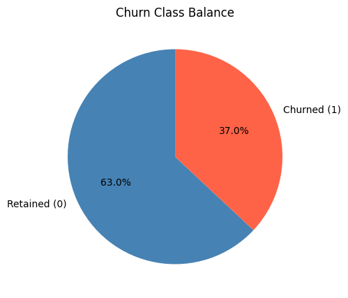
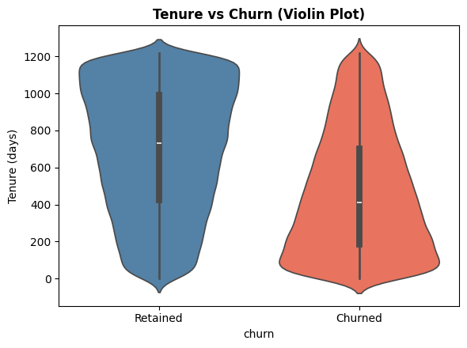
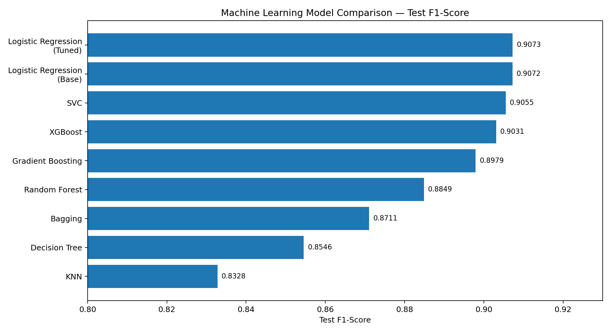
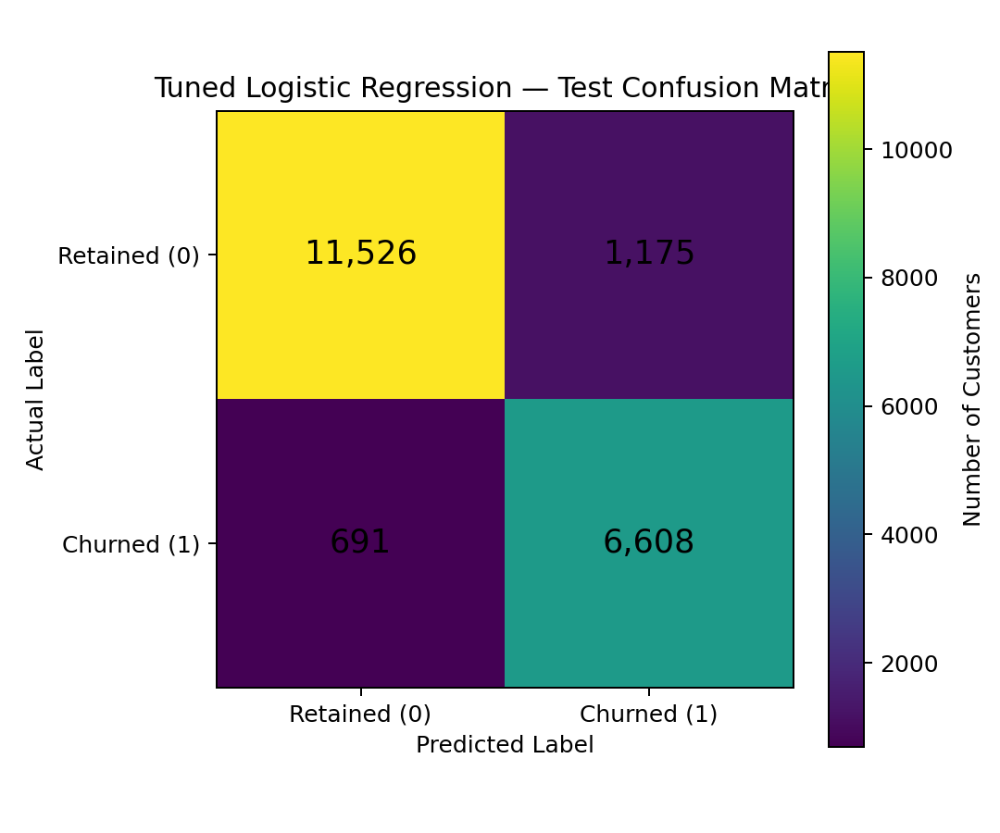

# 📊 Predicting Customer Churn in the Indian Telecom Industry

An end-to-end Machine Learning project for predicting customer churn in the Indian telecommunications industry using customer demographics, service usage, account information, and behavioral attributes.

## 🎯 Project Overview

Customer churn is a major challenge in the telecommunications industry. The objective of this project is to build a Machine Learning classification system that can identify customers who are likely to leave a telecom service.

The project covers the complete Machine Learning workflow:

* Data understanding and validation
* Exploratory Data Analysis (EDA)
* Data preprocessing
* Feature engineering
* Categorical encoding
* Feature scaling
* Class imbalance handling using SMOTE
* Multiple Machine Learning models
* Model evaluation and comparison
* Hyperparameter tuning
* Customer-level churn prediction
* Model interpretation

The dataset contains **100,000 customer records and 14 original columns**, with `churn` as the prediction target.

## 🎯 Business Objective

The goal is to help telecom businesses identify customers who are at risk of churn so that they can take proactive retention actions.

Potential business applications include:

* Identifying high-risk customers
* Improving customer retention
* Supporting targeted marketing campaigns
* Prioritizing customer-support efforts
* Reducing customer attrition
* Improving customer lifetime value
* Supporting data-driven retention strategies

## 📊 Dataset

**Dataset:** Telecom Churn Dataset
**Domain:** Indian Telecommunications
**Source:** Kaggle
**Target variable:** `churn`

The dataset contains customer demographic, account, subscription, and service-usage information.

### Key Features

* `customer_id`
* `telecom_partner`
* `gender`
* `age`
* `state`
* `city`
* `pincode`
* `date_of_registration`
* `num_dependents`
* `estimated_salary`
* `calls_made`
* `sms_sent`
* `data_used`
* `churn`

The notebook confirms that the dataset contains **100,000 rows and 14 columns**.

## 🔍 Exploratory Data Analysis

The project includes both univariate and bivariate analysis to understand customer behavior and churn patterns.

EDA includes:

* Churn class distribution
* Age distribution
* Tenure distribution
* Telecom partner distribution
* Data usage distribution
* Churn rate by telecom partner
* Tenure vs churn
* Age vs churn
* Calls, SMS and data usage vs churn
* Churn rate by number of dependents
* Data usage vs calls
* Registration-month churn analysis
* Multivariate relationship analysis

The analysis found that churn represents a significant minority class, requiring appropriate classification and imbalance-handling techniques.

### 📊 Churn Distribution



### 📈 Tenure vs Churn



## 🧹 Data Preprocessing

The following preprocessing steps were performed:

### Data Quality

* Missing-value check
* Duplicate check
* Outlier analysis

The notebook found **no missing values** and **no duplicate records**.

### Feature Engineering

The original registration date was transformed into useful features such as:

* `tenure_days`
* `registration_month`

The raw date column was then removed.

Identifier/high-cardinality columns such as:

* `customer_id`
* `city`
* `pincode`

were removed because they were not considered useful predictive features.

### Encoding

Categorical variables were transformed using:

* Binary encoding for `gender`
* One-hot encoding for `telecom_partner`
* One-hot encoding for `state`

### Feature Scaling

Numerical/model features were standardized using:

`StandardScaler`

### Class Imbalance

SMOTE was applied to the training data to balance the target classes.

After SMOTE:

* Class 0: **50,322**
* Class 1: **50,322**
* Total balanced training samples: **100,644**

## 🤖 Machine Learning Models

The following models were evaluated:

1. Logistic Regression
2. K-Nearest Neighbors (KNN)
3. Support Vector Classifier (SVC)
4. Decision Tree
5. Random Forest
6. Bagging Classifier
7. Gradient Boosting
8. XGBoost
9. Tuned Logistic Regression

## 📈 Model Evaluation

The models were evaluated using:

* Accuracy
* Precision
* Recall
* F1-Score
* Classification Report
* Confusion Matrix

### Test Performance

| Model                          | Test F1-Score |
| ------------------------------ | ------------: |
| 🥇 Logistic Regression (Tuned) |    **0.9073** |
| Logistic Regression (Base)     |        0.9072 |
| SVC                            |        0.9055 |
| XGBoost                        |        0.9031 |
| Gradient Boosting              |        0.8979 |
| Random Forest                  |        0.8849 |
| Bagging                        |        0.8711 |
| Decision Tree                  |        0.8546 |
| KNN                            |        0.8328 |

The notebook's model-comparison section ranks the models by test F1-score, with tuned Logistic Regression performing marginally better than the base Logistic Regression.

### 🤖 Model Comparison



## 🏆 Final Model

### Logistic Regression with Hyperparameter Tuning

The tuned Logistic Regression model was selected as the final model.

**Test performance:**

* **Accuracy:** ~91%
* **F1-Score:** ~0.91
* **Precision:** ~0.91
* **Recall:** ~0.91

The training and test performance are very similar, indicating good generalization in this experiment.

### 📊 Confusion Matrix



## 🔮 Customer Churn Prediction

The project includes a reusable prediction function that accepts customer information and returns:

* Churn prediction
* Churn/retained label
* Retention probability
* Churn probability

The notebook also includes an explanation function for the Logistic Regression model that calculates feature contributions for individual predictions.

### Example Predictions

**Profile A — New customer with low usage**

Prediction:

`Churned`

**Profile B — Long-term customer with high usage**

Prediction:

`Retained`

These examples demonstrate how the trained model can be used for customer-level churn-risk prediction.

## 🛠️ Technologies Used

* Python
* Pandas
* NumPy
* Matplotlib
* Seaborn
* Scikit-learn
* imbalanced-learn
* XGBoost
* Joblib
* Jupyter Notebook
* Google Colab

The notebook documents Python, Pandas, NumPy, Matplotlib, Seaborn, Scikit-learn, XGBoost, Google Colab and Jupyter Notebook as project technologies.

## 📁 Project Structure

```text
Predicting-Customer-Churn-Indian-Telecom/
│
├── Predicting_Customer_Churn_in_the_Indian_Telecom_Industry.ipynb
├── README.md
├── requirements.txt
├── LICENSE
└── .gitignore
```

## 🚀 How to Run

### 1. Clone the repository

```bash
git clone <your-repository-url>
cd Predicting-Customer-Churn-Indian-Telecom
```

### 2. Install dependencies

```bash
pip install -r requirements.txt
```

### 3. Open the notebook

```bash
jupyter notebook
```

Then open:

```text
Predicting_Customer_Churn_in_the_Indian_Telecom_Industry.ipynb
```

### Google Colab

The notebook was developed using Google Colab and can also be opened directly in Colab.

> **Note:** The notebook currently loads the dataset from a local/Colab path. If another user wants to reproduce the project, the dataset path will need to be configured for their environment.

## 💡 Key Takeaways

* Customer churn can be modeled as a supervised binary classification problem.
* Data preprocessing and feature engineering are important parts of the workflow.
* SMOTE was used to address class imbalance in the training data.
* Multiple classification algorithms were compared rather than relying on a single model.
* Logistic Regression achieved the strongest overall test performance in this project.
* Hyperparameter tuning produced a slightly improved F1-score.
* The final system can generate churn/retention predictions for new customer profiles.
* Individual Logistic Regression predictions can also be examined through feature contributions.

## 📌 Project Highlights

**End-to-End ML Pipeline**
Data preparation → EDA → Feature Engineering → Encoding → Scaling → SMOTE → Model Training → Evaluation → Tuning → Prediction

**Multiple Models Compared**
Nine classification approaches were evaluated.

**Best Model**
Tuned Logistic Regression with approximately **91% test accuracy and 0.91 F1-score**.

**Prediction System**
The project includes reusable prediction functionality for new customer profiles.

## 👨‍💻 Author

Sreehari.P

Data Science | Machine Learning | Data Analytics

---

⭐ If you find this project useful, consider giving the repository a star.
